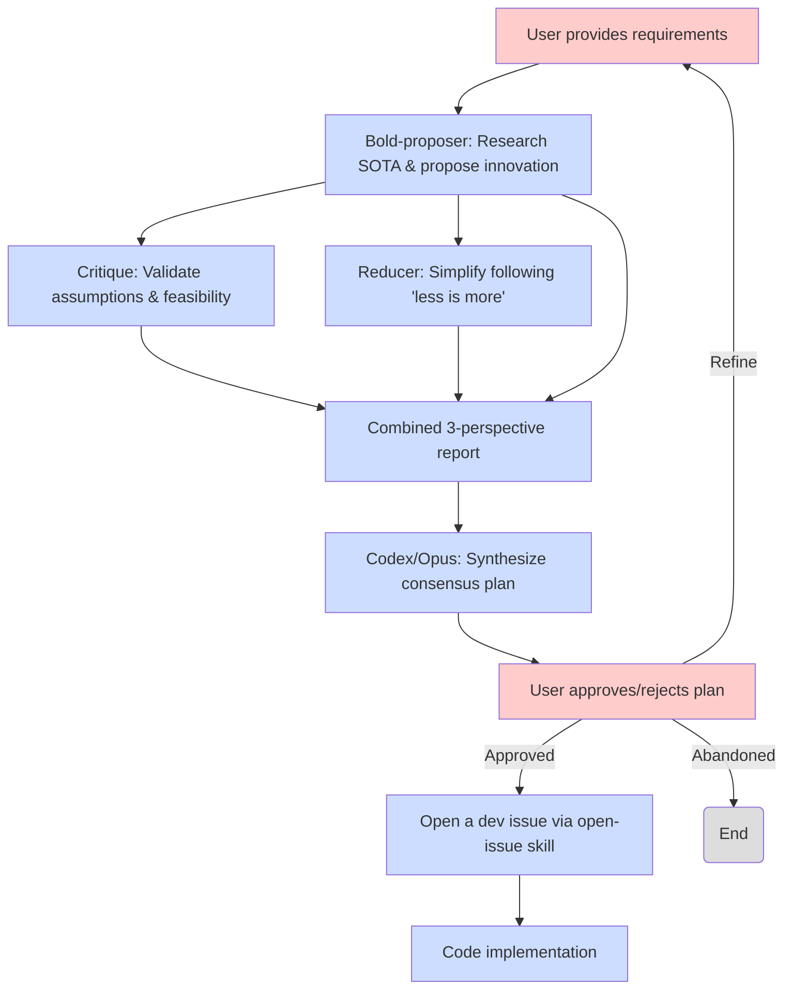
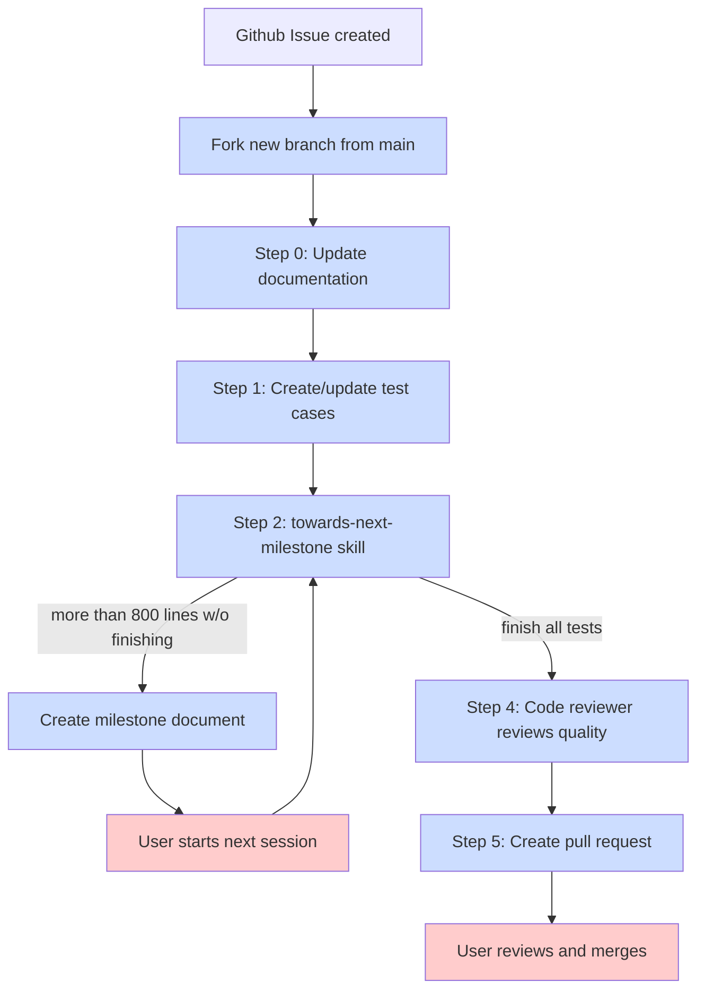

# AI-powered SDK for Software Development

## Quick Start

1. Clone this repository:
```bash
git clone https://github.com/SyntheSys-Lab/agentize.git
```
2. Use this repository to create an SDK for your project.
```
make agentize \
   AGENTIZE_PROJECT_NAME="your_project_name" \
   AGENTIZE_PROJECT_PATH="/path/to/your/project" \
   AGENTIZE_PROJECT_LANG="c" \
   AGENTIZE_MODE="init"
```

This will create an initial SDK structure in the specified project path.
For more details of the variables and options available, refer to our
[usage document](./docs/OPTIONS.md).

## Core Phylosophy

1. Plan first, code later: Use AI to generate a detailed plan before writing any code.
   - Plan is put on Github Issues for tracking.
2. Build [skills](https://agentskills.io/).
   - Skills are modular reusable, formal, and lightweighted flow definitions.
   - This is something like C-style declaration and implementation separation.
     - `/commands` are declarations and interfaces for users to invoke skills.
     - `/skills` are implementations of the skills.
3. Bootstrapping via self-improvement: We use `.claude/` as our canonical rules
   directory. We use these rules to develop these rules further.
   - Top-down design: Start with a high-level view of the development flow.
   - Bottom-up implementation: Implement each aspect of the flow from bottom, and finally
     integrate them together.

### Workflow:

`/ultra-planner` command flow (multi-agent debate-based planning):


`/issue2impl` command flow:


**Legend**
- Red boxes: user interventions, including providing development
requirements, approving/rejecting results (both intermediate and final),
and starting new development sessions.
- Blue boxes: automated steps performed by AI agents/skills/commands.

## Tutorials

Learn Agentize in 15 minutes with our step-by-step tutorials (3-5 min each):

1. **[Initialize Your Project](./docs/tutorial/00-initialize.md)** - Set up Agentize in new or existing projects
2. **[Plan an Issue](./docs/tutorial/01-plan-an-issue.md)** - Create implementation plans and GitHub issues
3. **[Ultra Planner](./docs/tutorial/01b-ultra-planner.md)** - Multi-agent debate-based planning for complex features
4. **[Issue to Implementation](./docs/tutorial/02-issue-to-impl.md)** - Complete development cycle with `/issue-to-impl`, `/code-review`, and `/sync-master`
5. **[Advanced Usage](./docs/tutorial/03-advanced-usage.md)** - Scale up with parallel development workflows

## Cross-Project Shell Functions

Agentize provides a `wt` shell function for managing worktrees from any directory. This enables `wt spawn 42` to work from any git repository, always creating worktrees in the correct location.

### Setup

**Option 1: Manual Setup (Recommended)**

Add to your shell RC file (`~/.bashrc`, `~/.zshrc`, etc.):

```bash
export AGENTIZE_HOME="/path/to/agentize"
source "$AGENTIZE_HOME/scripts/wt-functions.sh"
```

**Option 2: Automated Setup**

Run the setup helper (prints instructions by default):

```bash
./scripts/setup.sh
```

For automated installation (requires confirmation):

```bash
./scripts/setup.sh --install
```

### Usage

From any directory:

```bash
wt spawn 42              # Create worktree for issue #42
wt list                  # List all worktrees
wt remove 42             # Remove worktree for issue #42
wt prune                 # Clean up stale worktree metadata
```

The `wt` function ensures worktrees are always created under `$AGENTIZE_HOME/trees/`, regardless of your current directory.

### Requirements

- `AGENTIZE_HOME` environment variable must point to the agentize repository
- The function will fail with a clear error if `AGENTIZE_HOME` is missing or invalid

## Agentize CLI Wrapper

For convenience, Agentize provides ergonomic `agentize init` and `agentize update` commands as alternatives to the verbose `make agentize` interface. The make interface remains the canonical implementation.

### Setup

The `agentize` shell function is sourced alongside `wt` using the same setup:

**Option 1: Manual Setup (Recommended)**

Add to your shell RC file (`~/.bashrc`, `~/.zshrc`, etc.):

```bash
export AGENTIZE_HOME="/path/to/agentize"
source "$AGENTIZE_HOME/scripts/wt-functions.sh"
source "$AGENTIZE_HOME/scripts/agentize-functions.sh"
```

**Option 2: Automated Setup**

The setup helper automatically includes both `wt` and `agentize` functions:

```bash
./scripts/setup.sh --install
```

### Usage

**Initialize a new project:**

```bash
agentize init --name my-project --lang python --path /path/to/project
```

Equivalent to:
```bash
make agentize AGENTIZE_PROJECT_NAME="my-project" \
              AGENTIZE_PROJECT_PATH="/path/to/project" \
              AGENTIZE_PROJECT_LANG="python" \
              AGENTIZE_MODE="init"
```

**Update an existing project:**

From project root or any subdirectory:
```bash
agentize update
```

Or specify explicit path:
```bash
agentize update --path /path/to/project
```

The `update` command finds the nearest `.claude/` directory by traversing parent directories, making it convenient to use from anywhere within your project.

### Requirements

- `AGENTIZE_HOME` environment variable must point to the agentize repository
- `init` requires explicit `--name` and `--lang` flags (no inference)
- `update` searches for nearest `.claude/` directory or accepts `--path` override
- The function prints the resolved project path before executing

## Project Organization

```plaintext
agentize/
├── docs/                   # Document
│   ├── draft/              # Draft documents for local development
│   ├── OPTIONS.md          # Document for make options
│   └── git-msg-tags.md     # Used by \commit-msg skill and command to write meaningful commit messages
├── scripts/                # Shell scripts and functions
│   ├── wt-functions.sh     # Cross-project wt shell function
│   ├── setup.sh            # Installation helper
│   └── worktree.sh         # Core worktree management
├── templates/              # Templates for SDK generation
├── .claude/                # Core agent rules for Claude Code
├── tests/                  # Test cases
├── .gitignore              # Git ignore file
├── Makefile                # Makefile for creating SDKs
└── README.md               # This readme file
```
