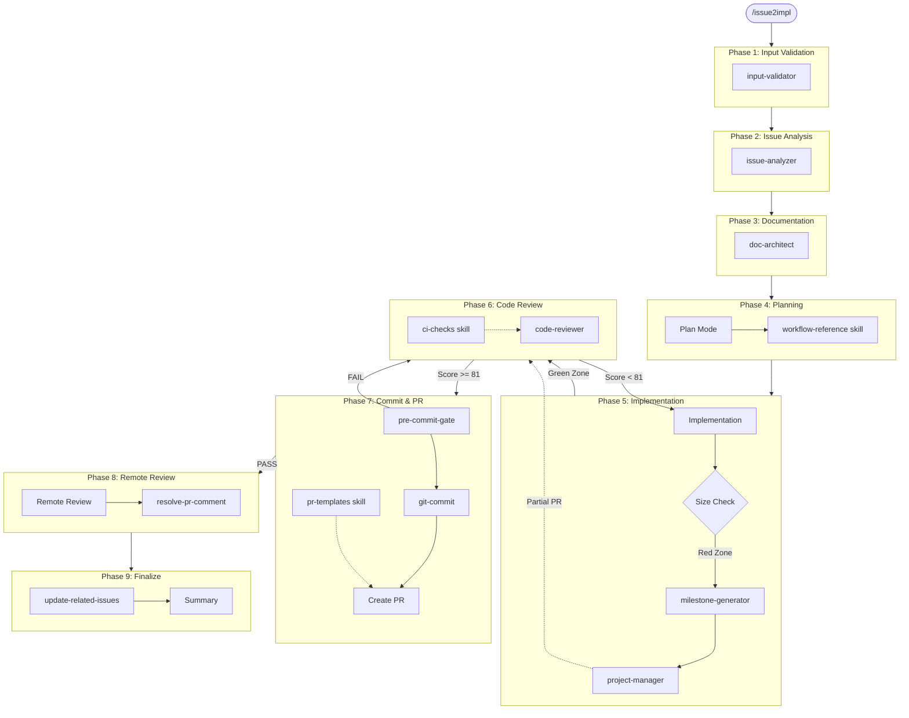
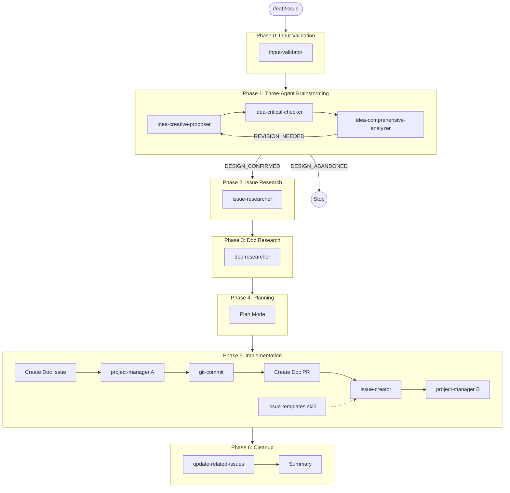

# Claude Code Configuration

This directory configures Claude Code for your project, providing automated workflows for issue resolution, idea-to-implementation pipelines, and code quality enforcement.

## Directory Structure

```
.claude/
├── CLAUDE.md           # Project-level instructions (loaded automatically)
├── settings.json       # Permission and hooks configuration
├── agents/             # Specialized subagents spawned by commands
├── commands/           # Slash commands (/command-name)
├── hooks/              # Lifecycle hooks (SessionStart, PostToolUse, etc.)
├── rules/              # Behavioral rules (auto-loaded or path-specific)
└── skills/             # Reference data and templates
```

## Component Types

| Type | Location | Purpose | Invocation |
|------|----------|---------|------------|
| **Commands** | `commands/*.md` | Entry points for workflows | `/command-name` |
| **Agents** | `agents/*.md` | Specialized subprocesses | Spawned by Task tool |
| **Skills** | `skills/*/SKILL.md` | Reference tables and templates | Skill tool |
| **Rules** | `rules/*.md` | Behavioral constraints | Auto-loaded or path-matched |
| **Hooks** | `hooks/*.sh` | Deterministic lifecycle behavior | Configured in settings.json |

## Meta-Commands

### /issue2impl

End-to-end workflow for resolving GitHub issues with code review cycles.

**3-Tier Triage System**: The workflow adapts based on issue complexity:

| Tier | Criteria | Workflow |
|------|----------|----------|
| **Fast** | Single file, doc-only, <50 lines, `quick-fix` label | Skip docs/planning, simplified review |
| **Standard** | Default | Full 9-phase workflow |
| **Extended** | Multi-component, >1500 lines, `complex` label | Add architecture review |

Note: Extended tier overrides fast tier if both criteria match.



**Component Integration:**

| Phase | Components | Purpose |
|-------|------------|---------|
| 1 | `input-validator` (Haiku) | Validate issue number, branch, dependencies |
| 2 | `issue-analyzer` | Analyze issue requirements and codebase |
| 3 | `doc-architect` | Interactive documentation brainstorming |
| 4 | `workflow-reference` skill | Size thresholds, L1/L2 tag inference |
| 5 | `milestone-generator` + `project-manager` | Create continuation issues when size exceeded |
| 6 | `code-reviewer` (Opus) + `ci-checks` skill | Skeptical code review with scoring |
| 7 | `pre-commit-gate` (Haiku) + `/git-commit` + `pr-templates` skill | Verify build, commit, create PR |
| 8 | `/resolve-pr-comment` | Handle remote review feedback |
| 9 | `/update-related-issues` | Update issue chain, generate summary |

---

### /feat2issue

Transform design ideas into actionable GitHub issues through interactive brainstorming.



**Three-Agent Brainstorming Chain:**

```
User Idea -> creative-proposer (divergent) -> critical-checker (convergent) -> comprehensive-analyzer (synthesis) -> User
                                                                                    |
                                                                         REVISION_NEEDED -> Loop back
```

| Agent | Model | Role |
|-------|-------|------|
| `idea-creative-proposer` | Opus | Generate bold alternatives, research prior art |
| `idea-critical-checker` | Opus | Fact-check claims, expose fallacies, challenge assumptions |
| `idea-comprehensive-analyzer` | Opus | Synthesize proposals and critiques, make recommendation |

---

## Agent-Command Coordination

```
Commands (Entry Points)
    │
    ├── /issue2impl ─┬─> input-validator
    │                   ├─> issue-analyzer
    │                   ├─> doc-architect
    │                   ├─> code-reviewer
    │                   ├─> milestone-generator ──> project-manager
    │                   └─> pre-commit-gate
    │
    ├── /feat2issue ┬─> input-validator
    │                   ├─> idea-creative-proposer
    │                   ├─> idea-critical-checker
    │                   ├─> idea-comprehensive-analyzer
    │                   ├─> issue-researcher
    │                   ├─> doc-researcher
    │                   ├─> issue-creator ──> project-manager
    │                   └─> project-manager (doc issue)
    │
    ├── /gen-milestone ─┬─> milestone-generator
    │                   └─> project-manager
    │
    └── /git-commit ────> (follows git-commit-format.md rule)
```

**Key Constraint:** Subagents cannot spawn other subagents. The main thread must spawn `project-manager` after receiving issue numbers from `milestone-generator` or `issue-creator`.

## Skills Reference

| Skill | Content | Used By |
|-------|---------|---------|
| `workflow-reference` | Size thresholds, L1/L2 tag inference, error handling | `/issue2impl` (Phases 4, 5, 7) |
| `pr-templates` | PR body templates, summary templates | `/issue2impl` (Phase 7, 9) |
| `issue-templates` | Feature, sub-issue, doc, refactor templates | `/feat2issue` (Phase 5) |
| `ci-checks` | Local CI validation (format, special chars, links) | Code review phase |

## Rules Summary

| Rule | Scope | Purpose |
|------|-------|---------|
| `language.md` | Always | English-only for all repository content |
| `git-commit-format.md` | `/git-commit` | Commit message format with tags |
| `issue-pr-format.md` | Issue/PR creation | 3-tag title system, SWE-Bench format |
| `milestone-guide.md` | Milestone generation | Structured milestone issue format |
| `project-board-integration.md` | Issue creation | Every issue must be added to GitHub Project |
| `custom-project-rules.md` | User-defined | Project-specific coding conventions |
| `custom-workflows.md` | User-defined | Project-specific workflows |

## Customization

The Agentize SDK is designed to be customizable for different project types:

1. **Core Rules**: Pre-configured, project-neutral rules in `rules/*.md`
2. **Custom Rules**: Add project-specific rules in:
   - `rules/custom-project-rules.md` - Coding conventions, testing requirements
   - `rules/custom-workflows.md` - Development workflows, deployment processes

3. **Component Tags**: Configure L1/L2 tags in `.claude/CLAUDE.md` to match your project structure

See `CUSTOMIZATION_GUIDE.md` for detailed instructions.

## Quick Reference

```bash
# Resolve an issue end-to-end
/issue2impl 123

# Transform idea into implementation issues
/feat2issue "Add user authentication feature"
/feat2issue ./docs/draft/my-idea.md

# Generate milestone for incomplete work
/gen-milestone

# Create commit following project standards
/git-commit

# Update related issues based on codebase state
/update-related-issues 123

# Resolve PR review comments
/resolve-pr-comment
```

## Installation

This configuration was installed using the Agentize SDK. To install in another project:

```bash
cd agentize/
make agentize \
  AGENTIZE_MASTER_PROJ=/path/to/target/project \
  AGENTIZE_PROJ_NAME="My Project" \
  AGENTIZE_MODE=port
```

See the main Agentize README for more installation options.

## Updating Your Configuration

To update to the latest Agentize SDK version:

```bash
cd agentize/
make agentize \
  AGENTIZE_MASTER_PROJ=/path/to/your-project \
  AGENTIZE_MODE=update
```

### What Happens During Update

1. **Backup Created**: `.claude.backup.YYYYMMDD-HHMMSS/` preserves your current state
2. **SDK Files Updated**: Agents, commands, skills, hooks, and SDK rules are replaced
3. **User Files Preserved**: `custom-project-rules.md` and `custom-workflows.md` are never touched
4. **Templated Files Prompted**: For files like `CLAUDE.md` with project-specific content, you'll be asked to review changes
5. **Orphans Reported**: Files in your `.claude/` that no longer exist in the SDK are reported (but not deleted)

### File Ownership Model

| Category | Examples | Update Behavior |
|----------|----------|-----------------|
| SDK-owned | `agents/*.md`, `commands/*.md`, `rules/git-commit-format.md` | Replaced |
| User-owned | `rules/custom-project-rules.md`, `rules/custom-workflows.md` | Preserved |
| Templated | `CLAUDE.md`, `git-tags.md`, `settings.json` | Interactive prompt |

### Rollback

If something goes wrong:
```bash
rm -rf .claude
mv .claude.backup.YYYYMMDD-HHMMSS .claude
```

