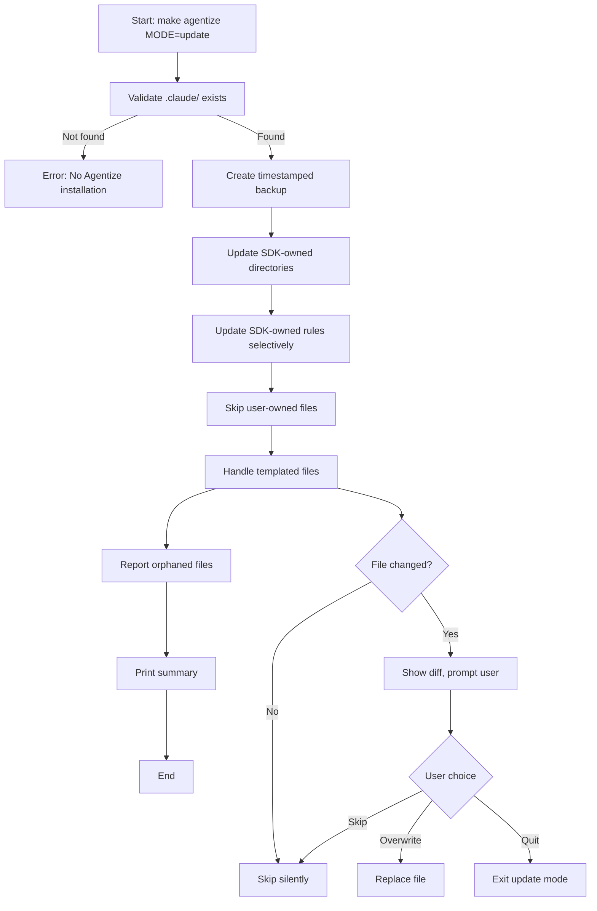

# SDK Update Mode Design Specification

**Created**: 2025-12-21
**Status**: Approved
**Related Draft**: `docs/draft/agentize-update-mode-20251221-095709.md`

## Overview

This document specifies the design and implementation of the "update" mode for the Agentize SDK installation system. Update mode enables users to refresh their `.claude/` configurations to match the latest SDK version while preserving project-specific customizations.

### Motivation

Currently, Agentize supports two installation modes:
- **init**: Full project initialization (Makefile, docs/, README, .claude/)
- **port**: Minimal installation (.claude/ only) for existing projects

When the Agentize SDK evolves with new agents, commands, or rules, users have no safe way to adopt these improvements without either:
1. Manually copying files (error-prone and tedious)
2. Deleting `.claude/` and re-running port mode (loses all customizations)
3. Tracking Agentize changes and applying manually (impractical)

Update mode solves this by automating SDK updates while protecting user customizations.

### Core Requirements

1. **Safety**: Never lose user customizations
2. **Transparency**: Users understand what changes and what is preserved
3. **Recoverability**: Easy rollback if something goes wrong
4. **Non-Breaking**: Existing init/port modes remain unchanged
5. **Simplicity**: Minimal implementation complexity

## Design Decisions

### Strategy Selection: Selective Copy

After evaluating multiple approaches (three-way merge, layered directories, git submodules, symlinks), we chose **selective copy with file ownership categories**.

**Rationale**:
- Non-breaking: Works with current `.claude/` directory structure
- No external dependencies: Pure bash implementation
- Simple mental model: Users understand "SDK files" vs "my files"
- Backward compatible: Existing installations work without modification

**Rejected alternatives**:
- **Three-way merge**: Markdown files lack semantic merge tools; conflicts require manual resolution anyway
- **Layered base/overrides architecture**: Claude Code does not support merging multiple `.claude/` directories (verified via official documentation)
- **Git submodules**: Notorious UX issues; requires git repo; adds complexity
- **Symlinks**: Poor Windows support; fragile (breaks if SDK moves); not portable

### Claude Code Compatibility

**Critical finding**: Claude Code uses a **precedence hierarchy** where "more specific scopes take precedence" but settings are **NOT merged** (source: [Claude Code Settings Documentation](https://code.claude.com/docs/en/settings)).

This eliminates layered directory proposals (`.claude/base/` + `.claude/overrides/`) without implementing a flattening mechanism, which adds unnecessary complexity.

### File Ownership Model

Files are categorized into three ownership types:

| Category | Update Behavior | Examples |
|----------|-----------------|----------|
| **SDK-owned** | Always replaced | `agents/*.md`, `commands/*.md`, `skills/**/*`, `hooks/**/*`, most `rules/*.md` |
| **User-owned** | Never touched | `rules/custom-project-rules.md`, `rules/custom-workflows.md` |
| **Templated** | Prompt user | `CLAUDE.md`, `git-tags.md`, `settings.json`, `PROJECT_CONFIG.md` |

**Rationale**:
- **SDK-owned files**: Contain SDK logic that users should not modify; changes indicate user misunderstanding of customization model
- **User-owned files**: Explicitly documented as safe customization points; named with "custom-" prefix for clarity
- **Templated files**: Contain project-specific values (`${PROJECT_NAME}`, `${MASTER_PROJ}`); cannot be auto-merged; require user decision

### Templated File Handling

Templated files present a unique challenge because they:
1. Originate from SDK templates with variable substitution
2. Contain project-specific values that cannot be regenerated
3. May have been customized by users after generation

**Chosen approach**: Interactive prompts with diff preview

**User workflow**:
1. Detect if SDK template changed since installation
2. Show diff between current file and new template
3. Prompt: `[s]kip`, `[o]verwrite`, `[d]iff` (show again), `[q]uit`
4. Respect user choice

**Rationale**: This provides maximum user control and transparency. Auto-merge would produce conflict markers requiring manual resolution anyway.

### Deletion Semantics (Orphaned Files)

**Decision**: Report orphaned files but **never auto-delete**.

Orphaned files are files present in target `.claude/` but not in current SDK (e.g., removed SDK files, user-created custom agents).

**Rationale**:
- Safety-first: Deleting files is irreversible (even with backup, users may not notice)
- Ambiguity: Can't distinguish user-created files from removed SDK files
- Low cost: Extra files cause minimal harm; users can review and delete manually

## File Ownership Specification

### SDK-Owned Files (Always Replaced)

```
.claude/
├── agents/
│   ├── general-purpose.md
│   ├── Explore.md
│   ├── Plan.md
│   ├── claude-code-guide.md
│   ├── statusline-setup.md
│   ├── milestone-generator.md
│   ├── issue-researcher.md
│   ├── input-validator.md
│   ├── pre-commit-gate.md
│   ├── doc-architect.md
│   ├── issue-creator.md
│   ├── idea-comprehensive-analyzer.md
│   ├── issue-analyzer.md
│   ├── idea-critical-checker.md
│   ├── project-manager.md
│   └── idea-creative-proposer.md
├── commands/
│   ├── ci-checks.md
│   ├── issue-templates.md
│   ├── pr-templates.md
│   ├── workflow-reference.md
│   ├── update-related-issues.md
│   ├── feat2issue.md
│   ├── gen-milestone.md
│   ├── git-commit.md
│   ├── resolve-pr-comment.md
│   ├── apply-rules.md
│   ├── sync-project-assignees.md
│   └── issue2impl.md
├── skills/
│   └── [all skill directories]
├── hooks/
│   └── [all hook scripts]
├── README.md
└── rules/
    ├── language.md
    ├── git-commit-format.md
    ├── issue-pr-format.md
    ├── milestone-guide.md
    ├── file-movement-protocol.md
    ├── github-comment-attribution.md
    ├── project-board-integration.md
    └── summary-preferences.md
```

### User-Owned Files (Never Touched)

```
.claude/rules/
├── custom-project-rules.md
└── custom-workflows.md
```

**Documentation**: These files are documented in `claude/CUSTOMIZATION_GUIDE.md` as user customization points.

### Templated Files (Prompt User)

```
.claude/
├── CLAUDE.md               # Contains ${PROJECT_NAME}
├── git-tags.md             # Contains ${PROJECT_NAME}
├── settings.json           # Contains project paths
└── PROJECT_CONFIG.md       # May have user edits
```

**Template sources** (in SDK):
```
claude/templates/
├── CLAUDE.md.template
├── git-tags.template.md
├── settings.json.template
└── PROJECT_CONFIG.md
```

## Update Algorithm

### High-Level Flow



### Detailed Implementation Steps

#### Step 1: Validate Target

```bash
validate_update_target() {
    if [ ! -d "$MASTER_PROJ/.claude" ]; then
        log_error "No .claude/ directory found at $MASTER_PROJ"
        log_error "Use 'init' or 'port' mode to install Agentize first"
        exit 1
    fi

    log_info "Found existing Agentize installation"
}
```

#### Step 2: Create Backup

```bash
create_backup() {
    local timestamp=$(date +%Y%m%d-%H%M%S)
    local backup_dir="$MASTER_PROJ/.claude.backup.$timestamp"

    # Handle rare timestamp collision
    while [ -d "$backup_dir" ]; do
        backup_dir="${backup_dir}-${RANDOM}"
    done

    cp -r "$MASTER_PROJ/.claude" "$backup_dir" || {
        log_error "Failed to create backup"
        exit 1
    }

    log_success "Backup created: $backup_dir"
    echo "$backup_dir" > /tmp/agentize-backup-location.txt
}
```

#### Step 3: Update SDK-Owned Directories

```bash
update_sdk_directories() {
    local dirs=("agents" "commands" "skills" "hooks")
    local updated_count=0

    for dir in "${dirs[@]}"; do
        rm -rf "$MASTER_PROJ/.claude/$dir"
        cp -r "$AGENTIZE_SDK/claude/$dir" "$MASTER_PROJ/.claude/$dir"
        local count=$(find "$MASTER_PROJ/.claude/$dir" -type f | wc -l)
        log_success "Updated $dir/ ($count files)"
        updated_count=$((updated_count + count))
    done

    # Update README.md
    cp "$AGENTIZE_SDK/claude/README.md" "$MASTER_PROJ/.claude/README.md"
    log_success "Updated README.md"
    updated_count=$((updated_count + 1))

    echo "$updated_count"
}
```

#### Step 4: Update SDK-Owned Rules Selectively

```bash
update_sdk_rules() {
    local sdk_rules=(
        "language.md"
        "git-commit-format.md"
        "issue-pr-format.md"
        "milestone-guide.md"
        "file-movement-protocol.md"
        "github-comment-attribution.md"
        "project-board-integration.md"
        "summary-preferences.md"
    )

    local updated_count=0

    for rule in "${sdk_rules[@]}"; do
        cp "$AGENTIZE_SDK/claude/rules/$rule" "$MASTER_PROJ/.claude/rules/$rule"
        updated_count=$((updated_count + 1))
    done

    log_success "Updated rules/ ($updated_count files)"
    log_info "Preserved: custom-project-rules.md, custom-workflows.md"

    echo "$updated_count"
}
```

#### Step 5: Handle Templated Files

```bash
handle_templated_files() {
    local templates=("CLAUDE.md" "git-tags.md" "settings.json" "PROJECT_CONFIG.md")
    local skipped=0
    local replaced=0

    for template in "${templates[@]}"; do
        local sdk_file="$AGENTIZE_SDK/claude/templates/${template%.md}.template"
        [ ! -f "$sdk_file" ] && sdk_file="$AGENTIZE_SDK/claude/templates/$template"
        local target_file="$MASTER_PROJ/.claude/$template"

        # Check if file changed
        if ! diff -q "$sdk_file" "$target_file" >/dev/null 2>&1; then
            while true; do
                echo ""
                log_warning "Template file changed: $template"
                echo "  [s]kip (keep your version)"
                echo "  [o]verwrite (use SDK version)"
                echo "  [d]iff (show changes)"
                echo "  [q]uit (stop update)"
                read -p "Choice: " choice

                case "$choice" in
                    s|S)
                        log_info "Skipped: $template"
                        skipped=$((skipped + 1))
                        break
                        ;;
                    o|O)
                        cp "$sdk_file" "$target_file"
                        log_success "Overwrote: $template"
                        replaced=$((replaced + 1))
                        break
                        ;;
                    d|D)
                        diff -u "$target_file" "$sdk_file" | head -50
                        ;;
                    q|Q)
                        log_warning "Update cancelled by user"
                        exit 0
                        ;;
                    *)
                        log_error "Invalid choice. Use s/o/d/q."
                        ;;
                esac
            done
        fi
    done

    echo "$skipped $replaced"
}
```

#### Step 6: Report Orphaned Files

```bash
report_orphaned_files() {
    local orphans=()

    # Find files in target not in SDK
    while IFS= read -r file; do
        local rel_path="${file#$MASTER_PROJ/.claude/}"
        local sdk_path="$AGENTIZE_SDK/claude/$rel_path"

        # Skip user-owned files
        [[ "$rel_path" == "rules/custom-project-rules.md" ]] && continue
        [[ "$rel_path" == "rules/custom-workflows.md" ]] && continue

        # Check if exists in SDK
        [ ! -f "$sdk_path" ] && orphans+=("$rel_path")
    done < <(find "$MASTER_PROJ/.claude" -type f -not -path "*/.*")

    if [ ${#orphans[@]} -gt 0 ]; then
        log_warning "Orphaned files (in target but not in SDK):"
        for orphan in "${orphans[@]}"; do
            echo "  - $orphan"
        done
        log_info "These files were NOT deleted. Review manually if needed."
    fi

    echo "${#orphans[@]}"
}
```

#### Step 7: Print Summary

```bash
print_update_summary() {
    local backup_location=$(cat /tmp/agentize-backup-location.txt)

    echo ""
    echo "━━━━━━━━━━━━━━━━━━━━━━━━━━━━━━━━━━━━━━━━━━━━━━━━━━━━━━━"
    echo "Update Complete!"
    echo "━━━━━━━━━━━━━━━━━━━━━━━━━━━━━━━━━━━━━━━━━━━━━━━━━━━━━━━"
    echo ""
    echo "Summary:"
    echo "  Updated:   $1 files (SDK-owned)"
    echo "  Preserved: 2 files (user-owned)"
    echo "  Skipped:   $2 files (templated)"
    echo "  Replaced:  $3 files (templated)"
    echo "  Orphaned:  $4 files (not deleted)"
    echo "  Backup:    $backup_location"
    echo ""
    echo "To undo: rm -rf .claude && mv $backup_location .claude"
    echo ""
}
```

## Backup and Rollback Strategy

### Backup Creation

**Location**: `.claude.backup.YYYYMMDD-HHMMSS/` in target project root

**Format**: Timestamp ensures uniqueness and chronological sorting

**Collision handling**: Append random suffix if timestamp collision occurs (rare)

**Content**: Complete recursive copy of `.claude/` directory before any modifications

### Rollback Procedure

```bash
# Simple rollback (immediately after update)
rm -rf .claude
mv .claude.backup.YYYYMMDD-HHMMSS .claude

# Selective rollback (cherry-pick specific files)
cp .claude.backup.YYYYMMDD-HHMMSS/rules/my-file.md .claude/rules/
```

### Backup Retention

Backups are NOT auto-deleted. Users should:
- Review backup after update to confirm changes are acceptable
- Delete backup manually when satisfied: `rm -rf .claude.backup.*`
- Keep backup for safety if uncertain

**Future enhancement**: Consider `AGENTIZE_AUTO_CLEANUP_BACKUP=1` flag to delete backup on successful update.

## Error Handling

### Error Scenarios

| Error | Condition | Response |
|-------|-----------|----------|
| No .claude/ directory | Target never had Agentize installed | Error message: "No Agentize installation found. Use init or port mode first." Exit 1 |
| Backup creation fails | Permission denied or disk full | Error message with details. Exit 1. No modifications made. |
| User interrupts (Ctrl-C) | User cancels during prompts | Graceful exit. Backup exists for manual recovery. |
| File copy fails | Permission issues during update | Error logged. Backup preserved. Recommend rollback. |

### Error Handling Patterns

```bash
# All critical operations check exit status
cp -r "$source" "$dest" || {
    log_error "Failed to copy $source to $dest"
    log_info "Backup preserved at: $backup_dir"
    exit 1
}

# User interrupts are handled gracefully
trap 'log_warning "Update interrupted. Backup preserved: $backup_dir"; exit 130' INT
```

## Edge Cases

### Edge Case 1: Modified SDK-Owned Files

**Scenario**: User modifies `agents/general-purpose.md` (SDK-owned file)

**Behavior**: File is replaced with SDK version during update

**Rationale**: User should use custom agents or custom-project-rules.md for modifications

**Documentation**: `claude/CUSTOMIZATION_GUIDE.md` warns against modifying SDK-owned files

### Edge Case 2: User-Created Agents

**Scenario**: User creates `.claude/agents/my-agent.md`

**Behavior**: Reported as orphaned, NOT deleted

**Rationale**: Ambiguous whether it's a custom agent or removed SDK agent; safety-first

**Future enhancement**: Could support `.claude/custom-agents/` directory for clear user content

### Edge Case 3: Backup Directory Already Exists

**Scenario**: Timestamp collision (two updates in same second)

**Behavior**: Append random suffix: `.claude.backup.20251221-095709-12345`

**Rationale**: Rare but possible; prevents overwriting previous backup

### Edge Case 4: Partial Update Failure

**Scenario**: Update fails after modifying some files

**Behavior**: Error logged, backup preserved, recommend rollback

**Mitigation**: Consider transaction-like behavior: update to temp directory first, then atomic rename (future enhancement)

## Testing Strategy

### Unit-Level Testing

Test individual functions in isolation:
- `validate_update_target()`: Test with/without .claude/ directory
- `create_backup()`: Test backup creation, collision handling
- `update_sdk_directories()`: Test file replacement counts
- `handle_templated_files()`: Test diff detection, user input handling

### Integration Testing

Test complete update workflows:
1. **Happy path**: Init → modify user files → update → verify SDK files updated, user files preserved
2. **Templated files**: Init → modify CLAUDE.md → update → verify prompt appears, choice respected
3. **Orphaned files**: Init → add custom file → update → verify reported but not deleted
4. **Rollback**: Update → rollback → verify original state restored
5. **Error handling**: Update with permission denied → verify backup preserved, clear error

### Regression Testing

Ensure update mode doesn't break init/port:
- Run init mode → verify unchanged behavior
- Run port mode → verify unchanged behavior
- Run update mode → then init mode in different project → verify no interference

### Manual Testing Scenarios

- Update with no changes → verify graceful no-op
- Update with only SDK changes → verify smooth update
- Update with only user changes → verify user files preserved
- Mixed scenario: SDK changes + user changes + templated changes

## Future Enhancements

### Priority 1 (Next Version)

1. **Dry-run mode**: `AGENTIZE_DRY_RUN=1` shows what would change without modifying
   - Implementation: Perform all checks and diffs, log intended actions, skip actual file operations
   - Value: Users can preview changes before committing

2. **Orphan cleanup flag**: `AGENTIZE_CLEAN_ORPHANS=1` prompts to delete orphaned files
   - Implementation: After reporting orphans, prompt "Delete? [y/N]" for each
   - Value: Keeps `.claude/` directory clean

### Priority 2 (Future Versions)

3. **Version tracking**: Store SDK version in `.claude/.agentize-version`
   - Implementation: Write version file during init/port/update
   - Value: Enable smarter updates, version compatibility warnings

4. **Non-interactive mode**: `AGENTIZE_YES=1` auto-accepts prompts
   - Implementation: Skip user prompts, use default (skip templated files)
   - Value: Enable CI/CD automation

5. **Component-level updates**: `AGENTIZE_UPDATE_COMPONENTS=agents,rules`
   - Implementation: Update only specified components
   - Value: Granular control for advanced users

### Deferred Enhancements

- Three-way merge for markdown (complexity not justified)
- Automatic conflict resolution (requires semantic understanding)
- Integration with package managers (npm, pip) for SDK distribution

## References

### Internal Documentation

- Draft design: `docs/draft/agentize-update-mode-20251221-095709.md`
- Current installation system: `scripts/install.sh`
- Customization guide: `claude/CUSTOMIZATION_GUIDE.md`
- Project README: `README.md`

### External Prior Art

- [Chezmoi dotfile manager](https://www.chezmoi.io/why-use-chezmoi/) - Template-based configuration management
- [Claude Code Settings Documentation](https://code.claude.com/docs/en/settings) - Precedence hierarchy, not merging
- [AI SDK 5.0 Migration Guide](https://ai-sdk.dev/docs/migration-guides/migration-guide-5-0) - SDK update best practices

### Research Findings

Three-stage brainstorming analysis:
1. **Creative proposals**: Six alternative approaches evaluated (merge, layered, submodule, symlink, channels, daemon)
2. **Critical review**: Identified critical flaws (Claude Code compatibility, file ownership, templated files)
3. **Comprehensive synthesis**: Selected selective copy as optimal balance of simplicity, safety, and effectiveness

---

**Document Version**: 1.0
**Last Updated**: 2025-12-21
**Maintainer**: @were
