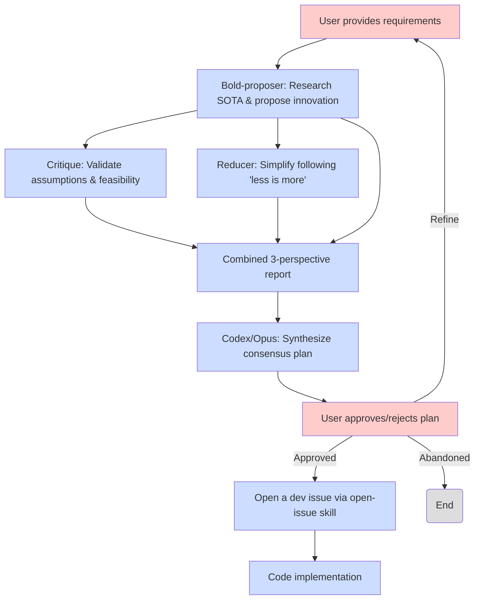

# Ultra Planner Workflow

Multi-agent debate-based planning workflow for complex features.

```mermaid
graph TD
    A[User provides requirements] --> B[Bold-proposer agent]
    B[Bold-proposer: Research SOTA & propose innovation] --> C[Proposal-critique agent]
    B --> D[Proposal-reducer agent]
    C[Critique: Validate assumptions & feasibility] --> E[Combine reports]
    D[Reducer: Simplify following 'less is more'] --> E
    B --> E
    E[Combined 3-perspective report] --> F[External consensus review]
    F[Codex/Opus: Synthesize consensus plan] --> G[User approves/rejects plan]
    G -->|Approved| H[Create Github Issue]
    G -->|Refine| A
    G -->|Abandoned| Z(End)
    H[Open a dev issue via open-issue skill] --> I[Code implementation]

    style A fill:#ffcccc
    style G fill:#ffcccc
    style B fill:#ccddff
    style C fill:#ccddff
    style D fill:#ccddff
    style E fill:#ccddff
    style F fill:#ccddff
    style H fill:#ccddff
    style I fill:#ccddff
    style Z fill:#dddddd
```
